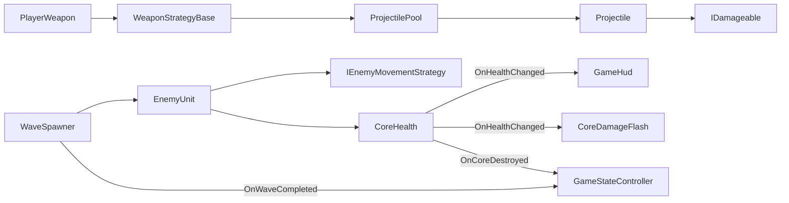

# CENG454 HW3 Report Draft

## 1. Cover Page

Full Name: Orhan Ciftci  
Student ID: 220444403  
GitHub Repository URL: `https://github.com/[username]/CENG454-HW3-Orhan-Ciftci-220444403`  
Homework Title: CENG454 HW3 - Core Breach: Pattern-Driven Systems Prototype  
Submission Date: 17 May 2026

> Change the name, student ID, GitHub username, and date if any of these are not correct.

## 2. Gameplay Overview

Core Breach is a short 2D defend-the-core prototype. The player controls a facility defender, moves around the arena, aims with the mouse, and fires at hostile units before they reach the central energy core. The player wins when all spawned enemies are destroyed and the core survives. The player loses when enemy contact damage reduces the core health to zero.

## 3. Architecture Overview

Major systems:

- `CoreHealth` owns objective health and publishes health/destruction events.
- `GameHud`, `CoreDamageFlash`, and `GameStateController` subscribe to core events without being directly controlled by the core.
- `PlayerWeapon` owns firing input but delegates firing behavior to `WeaponStrategyBase` assets.
- `ProjectilePool` owns reusable projectile instances, while each `Projectile` resets velocity, lifetime, damage, and owner state on reuse.
- `WaveSpawner` owns encounter pacing and alternates between direct and strafing enemy prefabs.
- `EnemyUnit` owns enemy health/contact damage and delegates movement to `IEnemyMovementStrategy`.

Suggested diagram for the PDF:

## 4. Pattern Justification Table

| Pattern / Technique | Classes or Interfaces Involved | Problem Solved | Why This Choice Was Appropriate |
|---|---|---|---|
| Interfaces | `IDamageable`, `ITargetProvider`, `IWeaponStrategy`, `IEnemyMovementStrategy`, `IPoolable` | Prevents systems from depending on one exact concrete class. | Projectiles can damage anything that implements `IDamageable`; enemies can use any movement strategy that implements `IEnemyMovementStrategy`; pooled objects expose reset behavior without the pool knowing their internals. |
| Observer | `CoreHealth.OnHealthChanged`, `CoreHealth.OnCoreDestroyed`, `WaveSpawner.OnWaveCompleted`, subscribers `GameHud`, `CoreDamageFlash`, `GameStateController` | One gameplay change needs multiple reactions. | The core does not know about HUD, visual feedback, or game-state logic. New reactions can be added by subscribing instead of editing `CoreHealth`. |
| Strategy | `WeaponStrategyBase`, `SingleShotWeaponStrategy`, `SpreadShotWeaponStrategy`, `PlayerWeapon`; also `IEnemyMovementStrategy`, `DirectCoreMovementStrategy`, `StrafeCoreMovementStrategy`, `EnemyUnit` | Runtime behavior must be swappable without changing the owner class. | `PlayerWeapon` fires through a shared weapon contract, and `EnemyUnit` moves through a shared movement contract. Adding a new weapon or enemy movement style does not require rewriting the owner. |
| Object Pool | `ProjectilePool`, `Projectile`, `IPoolable` | Projectiles are spawned repeatedly during the encounter. | Reusing projectile objects avoids repeated instantiate/destroy churn. The projectile resets lifetime, velocity, damage, and owner state before reuse. |
| Decorator | `DamageBoostWeaponDecorator`, `WeaponStrategyBase`, wrapped `SingleShotWeaponStrategy` | A weapon upgrade should extend an existing weapon without duplicating the whole firing algorithm. | The decorator wraps another weapon strategy and multiplies its damage. This keeps upgrade logic separate from the base weapon and makes future modifiers easy to add. |

## 5. Screenshots and Evidence

Take and paste these seven screenshots into the final PDF:

1. Game View showing the arena and defendable energy core.
2. Code screenshot showing `IDamageable` plus its users/implementations, such as `CoreHealth`, `EnemyUnit`, and `Projectile`.
3. Code screenshot showing `CoreHealth.OnHealthChanged` and subscribers in `GameHud` or `CoreDamageFlash`.
4. Inspector or code screenshot showing weapon strategies or enemy movement strategies.
5. Inspector screenshot of `Projectile Pool` with the projectile prefab and initial size.
6. Code or Inspector screenshot of `DamageBoostWeaponDecorator` wrapping `PulseRifle`.
7. GitHub screenshot showing branches, pull requests, merge commits, or project board.

## 6. Debugging Story

During testing, one bug I encountered was that projectiles could keep their old movement state when reused. I diagnosed it by watching pooled projectiles after they were returned and fired again; some shots did not start cleanly from the muzzle direction. The problem was that the object pool reused the same Rigidbody2D object, but the projectile needed to clear velocity and lifetime-related state each time it was taken from or returned to the pool. I fixed it by resetting `remainingLifetime`, `damage`, `ownerLayer`, `linearVelocity`, and `angularVelocity` inside `OnTakenFromPool` and `OnReturnedToPool`.

## 7. Troubleshooting Answer: Debug Report #003

The visible symptom would be duplicated reactions after the core-damaged event, such as the same inactive or reused enemy playing a sound, spawning VFX, or running damage-response logic more than once. The root cause is that the enemy subscribed to the event during one lifetime but did not unsubscribe when it died or returned to the pool. Since pooled objects are not destroyed, the old subscription remains in the publisher's invocation list and becomes a ghost subscriber. The exact fix is to unsubscribe in `OnDisable`, `OnReturnedToPool`, or the enemy death cleanup path, matching the place where the subscription was created. A prevention rule is that every event subscription must have a clearly paired unsubscribe in the same lifecycle ownership model, and pooled objects must reset both gameplay state and external subscriptions before reuse.

## 8. Retrospective

The most helpful design choice was using interfaces and events around the core loop because it kept the objective, HUD, visual feedback, and game-state logic separated. Strategy also made the prototype easier to expand because new weapons and movement styles can be added without rewriting the player or enemy owner classes. If I continued the project, I would improve the encounter system with more wave profiles and add a small upgrade selection screen that creates more decorator combinations.

## Submission Checklist

- Public GitHub repo name: `CENG454-HW3-Orhan-Ciftci-220444403`
- PDF file name: `CENG454_HW3_Orhan_Ciftci_220444403.pdf`
- Course comment format: `CENG454(SPRING_2026)_ORHAN_CIFTCI_220444403_HW3`
- At least one Kanban board is visible.
- At least three feature branches exist, for example `feat/core-loop`, `feat/strategy-weapons`, `feat/object-pool-decorator`.
- At least two pull requests are merged, or the repository history clearly shows equivalent merge evidence.
